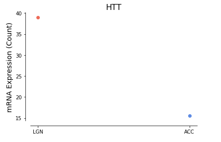
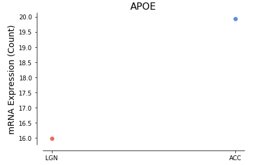
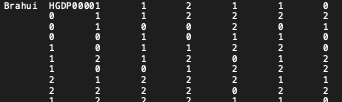
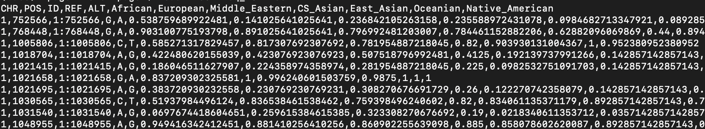

# OVARIE: Open-CRAVAT VARiant Interpretation Expansion

### Hackathon Members
Kymberleigh Pagel, Johns Hopkins University, Baltimore MD 21218, <kpagel1@jhu.edu>  <br>
Anna Chang, Johns Hopkins University, Baltimore MD 21205, <achang44@jhmi.edu> <br>
Zhi Liu, NIH, Bethesda MD 20892, <zhi.liu@nih.gov> <br>
Summer Rankin, Booz Allen Hamilton, Rockville MD 20852, rankin_summer@bah.com, summer.rankin@fda.hhs.gov <br>
Danielle Rubin, NIH, Bethesda MD 20892, <danielle.rubin@nih.gov>  <br>
Chris Shin, NIH/NIAID, Bethesda MD 20892, <chris.shin@nih.gov> <br>


## Introduction to Open-CRAVAT

[Open-CRAVAT](https://github.com/KarchinLab/open-cravat) is a python package that performs genomic variant interpretation. The modular and locally-installed command-line or GUI interface allows for  annoations of gene- and variant-level impact, interactions, conservation, and scoring. In this work, we advance the platform by the addition of new annotation sources to assist in the interrogation of genetic variation.

 
*Example of the Open-CRAVAT interface*

### Annotators
As of May 2019, the Open-CRAVAT Store has 65 annotators, converters, and visualization widgets available for use. Annotators range from genomic feature insights to population-level frequencies and clinical interpretations. Convertors take input in forms other than VCF (Variant Cell Format), such as dbSNP rsid and 23andMe formats, and make them compatible to Open-CRAVAT. There are currently three visualization widgets that can be downloaded: a summary of the top genes ranked by total variants, a haplotype information widget, and an embedded interactive genome visualization component developed by [Integrative Genomics Viewer (IGV)](https://github.com/igvteam/igv.js). 


*Home Page for the Open-CRAVAT store*

Data Sources Accessible through Open-CRAVAT | Type of Data
 ------- | ---
[1000 Genomes Project](http://www.internationalgenome.org/home) | allele frequencies
[The Cancer Genome Atlas](https://gdc.cancer.gov/about-data/publications/ATACseq-AWG) | genome-wide chromatin accessibility profiles of tumor samples 
| [BioGRID](https://thebiogrid.org/ )| gene interactions |
[BRCA1 Multiplex Assay](http://staritalab.org/)  | functional scores for SNVs 
[Cancer Gene Census (CGC)](https://cancer.sanger.ac.uk/census) | gene level data 
[Cancer Gene Landscape](http://science.sciencemag.org/content/339/6127/1546) | oncogenes and suppressor genes 
[CIViC](https://civicdb.org ) |clinical interpretation of variants in cancers
[ClinVar](https://www.ncbi.nlm.nih.gov/clinvar/ ) |relationships among human variations and phenotypes 
[COSMIC](https://cancer.sanger.ac.uk/cosmic )| somatic mutations in cancer
[dbSNP](https://www.ncbi.nlm.nih.gov/projects/SNP/)  | single nucleotide substitutions and short deletion and insertion polymorphisms
[denovo-db](http://denovo-db.gs.washington.edu/ )|germline de novo variants
[NHLBI GO Exome Sequencing Project (ESP)](http://evs.gs.washington.edu/EVS/) | exome variants
[Essential Genes](https://doi.org/10.1371/journal.pgen.1003484 )| genetic variation and mutational burden in human orthologs
[ExAC Gene and CNV](http://exac.broadinstitute.org/ )| probability of loss-of-function intolerance/intolerance
[Flanking Sequence](https://github.com/pdxgx/neoepiscope )| reference and alternate sequences for flanking bases
[Gene Ontology](http://geneontology.org/) | functions of genes and gene products
[GHIS](https://doi.org/10.1093/nar/gkv474) | haploinsufficiency scores 
[gnomAD](http://gnomad.broadinstitute.org/ )| exome and genome sequencing data
[GRASP](https://grasp.nhlbi.nih.gov/Overview.aspx ) | genome-wide associations between SNPs and phenotypes 
[GTEx](https://gtexportal.org/home/ ) | correlations between genotype and tissue-specific gene expression levels
[IntAct](https://www.ebi.ac.uk/intact/ ) | molecular interaction data
[Mutation Assessor](http://mutationassessor.org/r3/about.php) | prediction of functional impact of amino-acid substitutions in proteins 
[NCBI Gene](https://www.ncbi.nlm.nih.gov/gene)  | gene descriptions 
[ncRNA](https://www.girinst.org/server/RepBase/index.php) | non-coding RNA at variant location 
[NDEx](http://home.ndexbio.org/index/)  | biologic pathways 
[p(HI)](https://doi.org/10.1371/journal.pgen.1001154) | gene-based haploinsufficiency predictions 
[P(rec)](https://doi.org/10.1126/science.1215040) | rare and likely deleterious loss-of-function alleles 
[phastCons](https://sites.google.com/site/jpopgen/dbNSFP) | phastCons scores for multiple alignments 
[phyloP](https://sites.google.com/site/jpopgen/dbNSFP ) |conservation scoring for multiple alignments 
[Promoter IR](https://doi.org/10.1016/j.cell.2016.09.037 ) | interacting regions of promoters 
[Pseudogene](https://www.gencodegenes.org/) | annotations generated by GENCODE project 
[PubMed](https://www.ncbi.nlm.nih.gov/pubmed) | number of PubMed articles for a given gene |
[Repeat Sequences](http://genome.ucsc.edu) | annotation of repeat regions 
[RVIS](https://doi.org/10.1371/journal.pgen.1003709) | variation intolerance scoring 
[SiPhy](https://www.broadinstitute.org/mammals-models/29-mammals-project )| conservation scores based on mammal genomes
[TARGET](https://software.broadinstitute.org/cancer/cga/target) | genes directly linked to clinical action 
[UK10K Cohorts](https://www.uk10k.org/studies/cohorts.html) | genetic information from 2 twin studies
[UniProt](https://www.uniprot.org/) | protein sequence and annotation data 
[VISTA Enhancer Browser](https://enhancer.lbl.gov/)  | experimentally validated enhancers 


Analysis Tools Available through Open-CRAVAT | Function
-----|-----
[CHASMplus](http://chasmplus.readthedocs.io/en/latest/) | classification of missense mutations as drivers or passengers in human cancers 
[FATHMM](http://fathmm.biocompute.org.uk/index.html )| prediction of functional effects of protein missense mutations|
[GERP++](http://mendel.stanford.edu/SidowLab/downloads/gerp/index.html )| quantification of substitution deficits in multiple alignments
[IGV](http://www.insilico.us.com ) | interactive genome visualization
[InterPro](https://www.ebi.ac.uk/interpro/)  | functional analysis of proteins 
[LINSIGHT](http://github.com/CshlSiepelLab/LINSIGHT/blob/master/README.md ) | model generator for estimation of negative selection on noncoding sequences in the human genome
[LoFtool](https://doi.org/10.1093/bioinformatics/btv602 )| gene intolerance ranking system 
[MuPIT](http://mupit.icm.jhu.edu/MuPIT_Interactive/ )| mapping genomic coordinates of SNVs on 3D protein structures 
[MutPred](http://mutpred1.mutdb.org/ ) | classification of amino acid substitution 
[PhD-SNPg](http://snps.biofold.org/phd-snpg/index.html)  | predictor for pathogenic variants in coding and non-coding regions 
[REVEL](https://sites.google.com/site/revelgenomics/)| predictor for pathogenicity of missense variants 
[VEST](http://karchinlab.org/apps/appVest.html) | predictor for functional significance of missense mutations based on the probability that they are pathogenic 


### Installation

For local installation on Mac and Windows see the Quickstart guide [here](https://github.com/KarchinLab/open-cravat/wiki/quickstart)


## Hackathon Goals

Link to [Hackathon Plan and Workflow Slides](https://docs.google.com/presentation/d/1C_p9PoqMJO7S-NiPOicfLBqYM05rHTgOBhZ2nf1bzoY/edit?usp=sharing)

**(1) Add sources of single cell RNA-seq expression data** <br>

The [**Allen Brain Atlas**](http://human.brain-map.org/) includes a gene expression survey in multiple adult control brains integrating anatomic and genomic information. The dataset includes more than 62,000 gene probes per profile with around 500 samples per hemisphere across cerebrum, cerebellum and brainstem. In this work, we seek to create an Open-CRAVAT annotator that displays whether a given gene is expressed within different regions of the brain. A potential application for this annotator would include supporting the analysis of variants putatively related to ASD and other neurodevelopmental disease, to ascertain variants within genes that are expressed in the appropriate brain regions. 

**(2) Incorporate additional representation for under-studied populations** <br> 

The [**Human Genome Diversity Project**](https://www.hagsc.org/hgdp/) from a group of scientists across several labs at Stanford University analyzed DNA from 1,043 individuals among 51 different populations of Africa, Europe, Middle East, South and Central Asia, East Asia, Oceania and the Americas. Details on the individuals included in this collection are described in H. Cann et al. Science 296: 261-262 (2002) and its Supplemental Data; Rosenberg et al. Science 298: 2381-2385 (2002); and Rosenberg et al. PLoS Genetics 1: 660-671 (2005).

In particular, native American and Middle Eastern populations represent populations that are not well represented in Open-CRAVAT. In addition, several subpopulations evaluated in this work do not have representation in either the 1000 Genomes Project or gnomAD, two sources currently available in the Open-CRAVAT store. Due to small sample size n<10 for several subpopulations, we are required to present aggregate per-population allele frequencies to present more meaningful values. 

The [**Online Archive of Brazilian Mutations**](http://abraom.ib.usp.br/) is a variant repository containing genomic variants of Brazilians, with the goal to provide the community with genetic variability found in Brazil. The initial deposited cohort  comprise exomic variants of 609 elderly individuals from a census-based sample from the city of São Paulo. A total of 2,382,573 variants were called before filtering and are available at our browser. From that total, 1,264,224 are high confidence (GATK PASS flags and excluding CEGH-USP FDP/FAB flags), which we retain for use in Open-CRAVAT.


**(3) Stretch Goal: Identify sources of curated gene lists** <br>
Gene lists are groups of genes known to be influential in the development and/or maintenance of molecular pathways or diseases. We plan on implementing a module that allows users to see if the variants in their uploaded file correspond to a significant proportion of genes in validated gene lists.  

## Flowchart
To accomplish these tasks, we will need to carefully format the data and generate several accessory files necessary for incorporation into Open-CRAVAT 
 


### Components necessary to create an annotator (from [Open-CRAVAT wiki](https://github.com/KarchinLab/open-cravat/wiki/4.-Developer-Tutorial-(Annotators)))

An Open-CRAVAT annotator consists of a python file, a YAML file, a data directory, and a markdown file. The file structure is 

```text
annotator/
    |───annotator.md
    |───annotator.yml
    |───annotator.py
    └───data/
```

`annotator.md`: The markdown file describes the module to prospective users. 

`annotator.yml`: The YAML file defines the input and output interfaces between an annotator and the rest of Open-CRAVAT. The YAML file specifies what data will be fed to `annotator.py`, and what data Open-CRAVAT should expect `annotator.py` to return. 

`annotator.py`: The python module receives input data describing a single variant/gene, and uses it to lookup additional information specific to that annotator. An `annotator.py` works by extending a provided base class, `BaseAnnotator`, and implementing three instance methods: `setup`, `annotate`, and `cleanup`.


## Progress
### Goal 1: Add sources of single cell RNA-seq expression data 

We will aggregate single cell human RNA-seq data from the [Allen Brain Atlas](https://celltypes.brain-map.org/rnaseq) for genes of known functional significance in the brain to generate gene expression plots across several brain regions.

 <br>
*Raw RNA-Seq data from the Allen Brain Atlas*

The brain regions we are examining are the Anterior Cingulate Cortex (7283 single cells), the Lateral Geniculate Nucleus (1576 single cells), the Medial Temporal Gyrus, and Primary Visual Cortex. 

 <br>
*Example of Huntington Protein expression in two brain regions*

 <br>
*Example of APOE expression in two brain regions*


### Goal 2: Incorporate additional representation for under-studied populations


**HGDP allele frequencies**

We obtained the HGDP_938.geno file from the [Human Genome Diversity Project](https://www.hagsc.org/hgdp/). In total, there are  938 individuals from 52 populations. Populations were grouped into 7 subsets based on geographical locations. The population subsets were: African(129) , European (159), East_Asian(229), cental and south Asian(200), Oceanian(28), Middle Eastern(133) and Native Americans(63). Alternative allele frequency was calculated for each population. Allele frequency was generated for each population and put into CSV format for conversion to sqlite file. In total, the compiled allele frequencies are comprised of 632,958 variants across the 7 populations. 

 <br>
*HGDP source data file format*

 <br>
*HGDP allele frequency file format*


**ABraOM allele frequencies**

We obtained the file BRaOM_60+_SABE_609_exomes_annotated.gz from http://abraom.ib.usp.br/download/. After minor editing to reduce file size by the removal of additional data fields, we convert the remaining relevant data fields into a tsv file (ABraOM.tsv). The tsv file is converted into a sqlite for use by the Open-CRAVAT framework (abraom.sqlite). We additionally generated several files to interface between Open-CRAVAT and the sqlite table, as described above. Relevant files are included in the abroam folder. 

 <br>
*Screenshot of the newly-added ABraOM Brazillian allele frequencies*

### Stretch Goal: Assemble sources of well-curated gene lists

* MacArthur lab: https://github.com/macarthur-lab/gene_lists  <br>
  * Drug targets, essential genes, X-linked disease, mode of inheritance, minimum incidental findings 
* ImmPort https://www.immport.org/shared/genelists <br>
* Hallmark gene sets from MSigDB http://software.broadinstitute.org/gsea/msigdb/genesets.jsp?collection=H 
* Network of cancer genes http://ncg.kcl.ac.uk/ 
  * Can generate cancer-type specific gene lists using "Advanced" option
* [NetVenn](https://probes.pw.usda.gov/NetVenn/#&panel1-5) collection of gene sets for humans and animals  https://probes.pw.usda.gov/NetVenn/downloads.php <br>
* SFARI GENE https://www.sfari.org/resource/sfari-gene/


