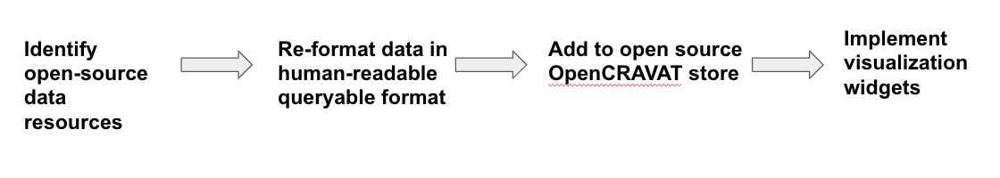

# An open store for variant and gene prioritization tools

## Hackathon Members
Kymberleigh Pagel
Anna Chang
Zhi Liu
Summer Raskin
Danielle Rubin
Chris Shin


## Introduction to Open-CRAVAT

Open-CRAVAT is a python package that performs genomic variant interpretation. The modular and locally-installed command-line or GUI interface allows for  annoations of gene- and variant-level impact, interactions, conservation, and scoring. In this work, we advance the platform by the addition of new annoation sources to assist in the interrogation of genetic variation.

 
*Example of the Open-CRAVAT interface*

### Annotators
As of May 2019, the Open-CRAVAT Store has 65 annotators and converters available for use. Annotators range from genomic feature insights to population-level frequencies and clinical interpretations. Convertors take input in forms other than VCF (Variant Cell Format), such as dbSNP rsid and 23andMe formats, and make them compatible to Open-CRAVAT.  

### Output

### Installation

For local installation on Mac and Windows see the Quickstart guide here: https://github.com/KarchinLab/open-cravat/wiki/quickstart

OpenCRAVAT developer tutorial is available here: https://github.com/KarchinLab/open-cravat/wiki/4.-Developer-Tutorial-(Annotators)

## Hackathon Goals and Flowchart

## Hackathon Plan and Workflow
https://docs.google.com/presentation/d/1C_p9PoqMJO7S-NiPOicfLBqYM05rHTgOBhZ2nf1bzoY/edit?usp=sharing

(1) Add in sources of single cell RNA-seq expression data <br>
(2) Additional representation for under-studied populations <br> 

The Human Genome Diversity Project https://www.hagsc.org/hgdp/ from Stanford analyzed DNA from 1,043 individuals among 51 different populations of Africa, Europe, Middle East, South and Central Asia, East Asia, Oceania and the Americas. Details on the individuals included in this collection are descibed in H. Cann et al. Science 296: 261-262 (2002) and its Supplemental Data; Rosenberg et al. Science 298: 2381-2385 (2002); and Rosenberg et al. PLoS Genetics 1: 660-671 (2005).

In particular, native American and Middle Eastern populations represent populations that are not well represented in OpenCRAVAT. In addition, several subpopulations evaluated in this work do not have representation in either the 1000 Genomes Project or gnomAD, two sources currently available in the OpenCRAVAT store. Due to small sample size n<10 for several subpopulations, we are required to present aggregate per-population allele frequencies to present more meaningful values. 

(3) Stretch goal: Identifying sources of curated gene lists

To accomplish these tasks, we will need to carefully format the data and generate several accessory files necessary for incorporation into OpenCRAVAT 
 


### Components necessary to create an annotator 

A cravat annotator consists of a python file, a YAML file, a data directory, and a markdown file. The file structure is 

```text
annotator/
    |───annotator.md
    |───annotator.yml
    |───annotator.py
    └───data/
```

`annotator.md`: The markdown file describes the module to prospective users. 

`annotator.yml`: The YAML file defines the input and output interfaces between an annotator and the rest of OpenCRAVAT. The YAML file specifies what data will be fed to `annotator.py`, and what data OpenCRAVAT should expect `annotator.py` to return. 

`annotator.py`: The python module receives input data describing a single variant/gene, and uses it to lookup additional information specific to that annotator. An `annotator.py` works by extending a provided base class, `BaseAnnotator`, and implementing three instance methods: `setup`, `annotate`, and `cleanup`.


## Progress
### Goal 1: Add in sources of single cell RNA-seq expression data 
### Goal 2: Representation for under-studied populations
### Stretch Goal: Assembling sources of well-curated gene lists

(1) MacArthur lab: https://github.com/macarthur-lab/gene_lists  <br>
(2) ImmPort https://www.immport.org/shared/genelists <br>
(3) Hallmark gene sets from MSigDB http://software.broadinstitute.org/gsea/msigdb/genesets.jsp?collection=H 


