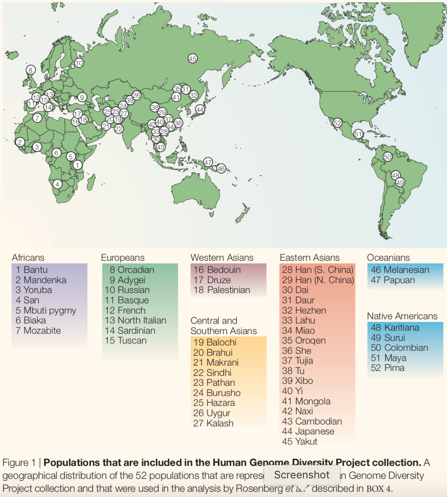
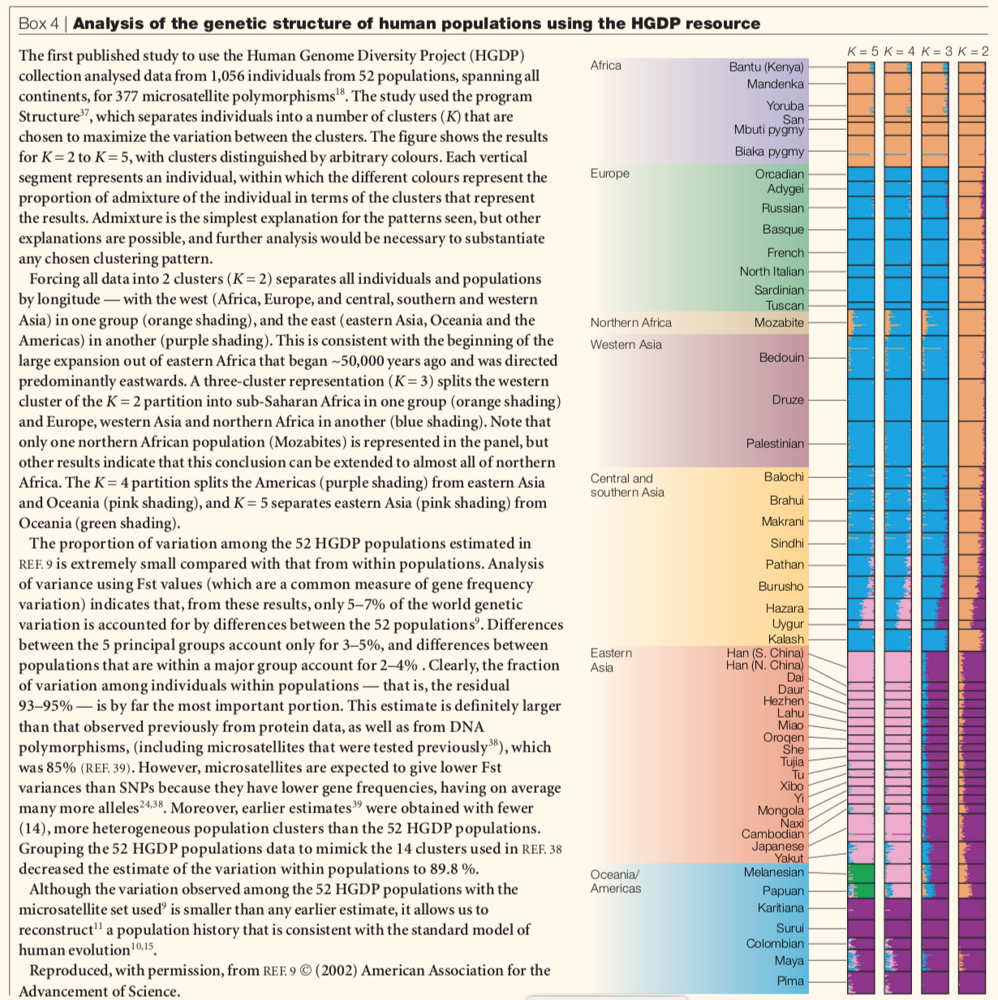

# Human Genome Diversity Project (HGDP)

The Human Genome Diversity Project from Stanford analyzed DNA from 1,043 individuals among 51 different populations of Africa, Europe, Middle East, South and Central Asia, East Asia, Oceania and the Americas. Details on the individuals included in this collection are described in H. Cann et al. Science 296: 261-262 (2002) and its Supplemental Data; Rosenberg et al. Science 298: 2381-2385 (2002); and Rosenberg et al. PLoS Genetics 1: 660-671 (2005).

## Outputs the following population's allele frequency if present:
1. african_allele_freq
2. european_allele_freq
3. middle_eastern_allele_freq
4. cs_asian_allele_freq
5. east_asian_allele_freq
6. oceanian_allele_freq
7. native_american_allele_freq

